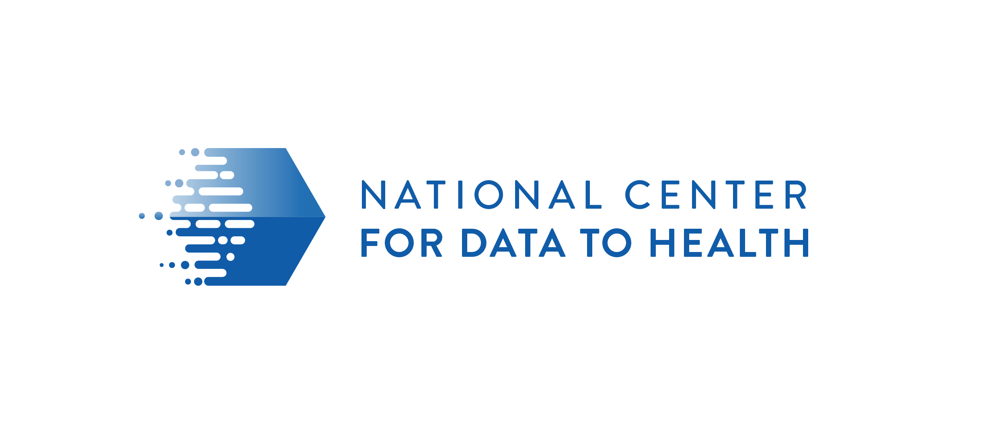

## Welcome to the Informatics Maturity Model Project

Maturity Models, a project of the National Center for Data to Health (grant U24TR002306), aims to help CTSAs define 

[About this project and its people](pages/about.md)

## Explore Our Work:

* [Research Informatics Open Science Maturity Model](pages/RIOSM.md)
* Comprehensive library of existing Maturity Models
* iDTF Maturity Models

## Engagement 
* [How you can contribute](pages/Engage.md)

Meet with us 9/24! Agenda can be found [here](https://docs.google.com/document/d/1lIDXXyKepx_pEMmJpgSTwmha6WXXVgvfEU-2wU4XDH0)

* [Provide Feedback](pages/provide_feedback.md)

## Working documents

