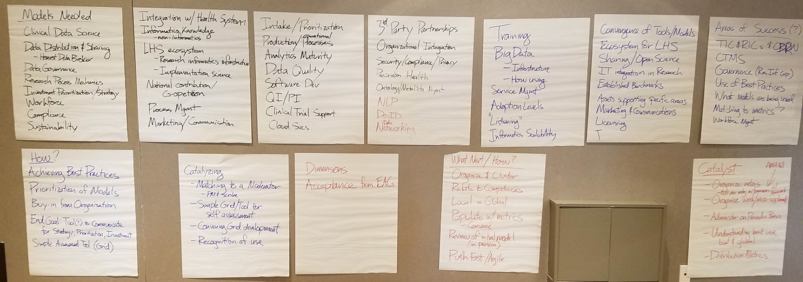

## iDTF Models

The following models (listed below) were requested by the iDTF members that attended the Maturity model breakout session that occurred at the 2019 Spring iDTF meeting in San Francisco. Thank you for your contribution!

iDTF Model | iDTF Model
----------|--------------|
Clinical Data Science | Data Distribution and Sharing 
Honest Broker | Data Governance
Enterprise Data Warehouse | Research Process Mechanics
Investment Prioritization / Strategy | Workforce
Compliance | Sustainability
Integration with Health System | Informatics Knowledge by non-informatics people
LHS: Research informatics infrastructure | LHS: Implementation Science
National contribution / Co-opetition | Process Management
Marketing / Communication | Intake /Prioritization
Production / Operational Processes | Analytics Maturity
Data Quality | Internal QI / PI processes by Informatics group
Clinical Trials Support | Cloud Services
3rd party partnerships | Organizational Integration
Security / Compliance / Privacy | Precision health
Ontology Management | NLP
De-Identification | Data Networking
Process Monitoring | Metrics-driven management

We preformed an extensive search of where these components fit in existing models. That information can be found [here](https://docs.google.com/spreadsheets/d/1cKjlV6u9y6S-ZRgr78zLP4KbXjc0bLXrfsOIXfYSF3E/edit#gid=0). 

#### Back to [home](https://data2health.github.io/maturity-model/)
